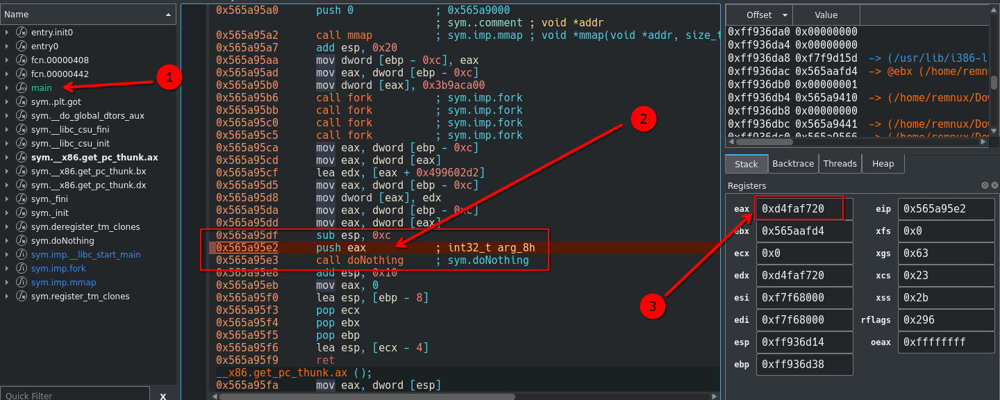

# 🚀 Forky

- **📛 Challenge Name:** Forky
- **🎯 Difficulty:** Hard  
- **🔗 Challenge:** [View on PicoCTF](https://play.picoctf.org/practice/challenge/24?category=3&originalEvent=1&page=2)  
- **🐧 File Type:** Linux ELF Binary  


## Introduction
In this post, we will walk through solving the `Forky` challenge and we use Ghidra and cutter to assist us in reverse-engineering (SRE) the challenge to uncover the flag.

## My Experience
what a funny name for challenge `Forky` . Let's take a look at the question.

<hr/>
In this program, identify the last integer value that is passed as parameter to the function doNothing().
<hr/>

Let's download it and use the `file` command in Linux to check what type of file this is. 
Let’s check the `file` command output below:

```console
remnux@remnux:/home/remnux/Downloads$ file vuln
/home/remnux/Downloads/vuln: ELF 32-bit LSB shared object, Intel 80386, version 1 (SYSV), dynamically linked, interpreter /lib/ld-linux.so.2, for GNU/Linux 3.2.0, BuildID[sha1]=836c8d5ecaad6d64f4a358cf73d060d0c5050e87, not stripped

```
It's an ELF file, so we need a Linux machine for running and reverse engineering. I use REMnux, but you can use any other machine without issues—just make sure to install Ghidra and Cutter if you're following my solution.


Let's open it in **Ghidra** and see what secrets this file holds! 🔍  
By the way, I cleaned up Ghidra's **main** function to make it easier to read. 🚀

### Ghidra
```c

/* WARNING: Function: __x86.get_pc_thunk.bx replaced with injection: get_pc_thunk_bx */
/* WARNING: Unknown calling convention -- yet parameter storage is locked */

int main(void)

{
  int *nothingArg;
  
  nothingArg = (int *)mmap(0,4,3,0x21,0xffffffff,0);
  *nothingArg = 1000000000;
  fork();
  fork();
  fork();
  fork();
  *nothingArg = *nothingArg + 0x499602d2;
  doNothing(*nothingArg);
  return 0;
}
```
As seen in Ghidra, the doNothing function takes an argument that we need to determine to solve the challenge and retrieve the flag.

The program uses `fork()` four times, meaning it creates multiple processes, and the challenge asks us to find the last value of `nothingArg`. Since this is difficult to determine through static analysis alone, we use Cutter to debug the binary.



Let's open the file in Cutter and locate the main function. Then, set a breakpoint just before the `doNothing` function is called. In the assembly code, you'll notice that the argument for the `doNothing` function is stored in the eax register, which holds the same value as edx. It doesn’t matter which one you check, but in this case, I copied the value from `eax`, and it was `0xd4faf720`.

Since our program is 32-bit and the value `0xd4faf720` is in hex, we need to consider that an int can hold both positive and negative values. To figure out the actual value, we can simply use C itself to convert this hex value into a signed 32-bit integer.

Let’s write a simple C code to find out what the value is when interpreted as a 32-bit integer:
```c
#include <stdio.h>

int main() {
    int a = 0xd4faf720;
    printf("%d\n", a);      
    return 0;
}

```
We can compile and run the C code with GCC to determine the value. Here’s what the process looks like:

```console
remnux@remnux:/tmp$ gcc -o main ./main.c && ./main
-721750240
```
As a result, the value of the hex **0xd4faf720** as a signed 32-bit integer is **-721750240**.

The flag is:
```
PICOCTF{-721750240}
```
