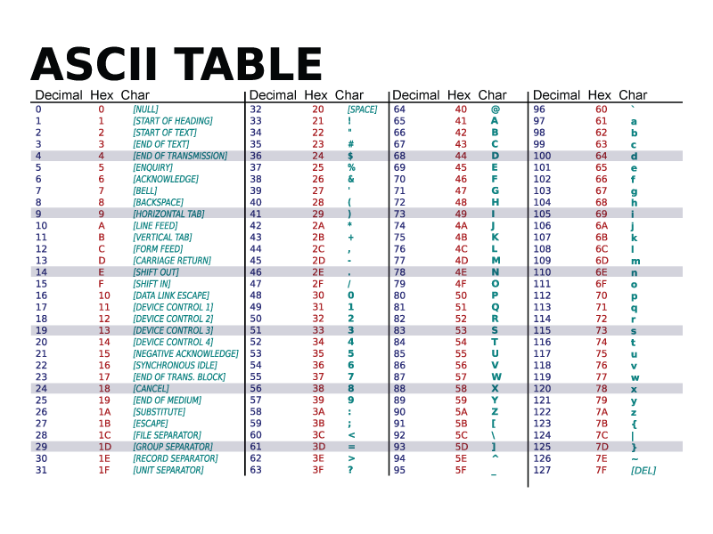

# Vault Door 4

## Introduction
Our goal is to determine the vault's password by analyzing the given Java source code. The program checks whether the user input matches a predefined byte sequence. Our task is to extract this byte sequence and convert it into a human-readable string. Our can achieve this using manual conversion, online tools, or writing a Java program. Once decoded, prepend picoCTF{ and append } to obtain the final flag.

## My Experience
New day, new challenge! Let's solve the "Vault Door 4" question:
<hr/>
"This vault uses ASCII encoding for the password. The source code for this vault is here: VaultDoor4.java"
<hr/>

Another Java code-based program—I expected that because, as the name suggests, it's a Vault Door challenge. Like before, it uses Java code. I opened it in VS Code, so let's take a look at what we have here:

```Java
import java.util.*;

class VaultDoor4 {
    public static void main(String args[]) {
        VaultDoor4 vaultDoor = new VaultDoor4();
        Scanner scanner = new Scanner(System.in);
        System.out.print("Enter vault password: ");
        String userInput = scanner.next();
        String input = userInput.substring("picoCTF{".length(), userInput.length() - 1);
        
        // Checking if the password is correct
        if (vaultDoor.checkPassword(input)) {
            System.out.println("Access granted.");
        } else {
            System.out.println("Access denied!");
        }
    }

    public boolean checkPassword(String password) {
        byte[] passBytes = password.getBytes();
        byte[] myBytes = {
            106, 85, 53, 116, 95, 52, 95, 98,
            0x55, 0x6e, 0x43, 0x68, 0x5f, 0x30, 0x66, 0x5f,
            0142, 0131, 0164, 063, 0163, 0137, 0143, 061,
            '9', '4', 'f', '7', '4', '5', '8', 'e'
        };

        // Comparing each byte to check for password match
        for (int i = 0; i < 32; i++) {
            if (passBytes[i] != myBytes[i]) {
                return false;
            }
        }
        return true;
    }
}
```

This one looks simpler than the previous challenges. As usual, the main part is the `checkPassword` function. Let's analyze it and see what it does:

```Java
public boolean checkPassword(String password) {
    byte[] passBytes = password.getBytes();
    byte[] myBytes = {
        106 , 85  , 53  , 116 , 95  , 52  , 95  , 98  ,
        0x55, 0x6e, 0x43, 0x68, 0x5f, 0x30, 0x66, 0x5f,
        0142, 0131, 0164, 063 , 0163, 0137, 0143, 061 ,
        '9' , '4' , 'f' , '7' , '4' , '5' , '8' , 'e' ,
    };
    for (int i=0; i<32; i++) {
        if (passBytes[i] != myBytes[i]) {
            return false;
        }
    }
    return true;
}
```
The checkPassword function simply converts the password to bytes. If you don't know, each character has its own value in the ASCII table. Computers store characters as numbers (binary), so they need an encoding table like ASCII or UTF-8 to convert these numbers into readable characters.

For example, in ASCII, 'A' has a value of 65 in decimal or 0x41 in hexadecimal.

Java strings use UTF-16, which supports over a million characters, but here we're dealing with ASCII values, which represent 128 characters.



The main question is how to convert these bytes to a string. There are many ways to do this, including using online tools, terminal commands, or even writing Java code. Why not use Java?

Here is the Java code I wrote:
```Java
public class App {
    public static void main(String[] args) throws Exception {
        String password = genPassword();
        System.out.println(password);
    }

    public static String genPassword() {
        char[] password = new char[32];
        byte[] myBytes = {
            106 , 85  , 53  , 116 , 95  , 52  , 95  , 98  ,
            0x55, 0x6e, 0x43, 0x68, 0x5f, 0x30, 0x66, 0x5f,
            0142, 0131, 0164, 063 , 0163, 0137, 0143, 061 ,
            '9' , '4' , 'f' , '7' , '4' , '5' , '8' , 'e' ,
        };

        for (int i = 0; i < myBytes.length; i++) {
            password[i] = (char) myBytes[i];
        }

        return new String(password);
    }
}
```

This code creates a char[] array to store the password. It loops over the bytes from the challenge, converts each one to a character, and then combines them into a string.

But there's an even simpler way! Java's String constructor accepts a byte array directly, so we can simplify it like this:

```Java
public static String genPassword() {  
    byte[] myBytes = {
        106 , 85  , 53  , 116 , 95  , 52  , 95  , 98  ,
        0x55, 0x6e, 0x43, 0x68, 0x5f, 0x30, 0x66, 0x5f,
        0142, 0131, 0164, 063 , 0163, 0137, 0143, 061 ,
        '9' , '4' , 'f' , '7' , '4' , '5' , '8' , 'e' ,
    };
    return new String(myBytes);
}
```

Let's run the code to see the password for this level:

The password is:
```
jU5t_4_bUnCh_0f_bYt3s_c194f7458e
```

Therefore, the flag is:
```
picoCTF{jU5t_4_bUnCh_0f_bYt3s_c194f7458e}
```
