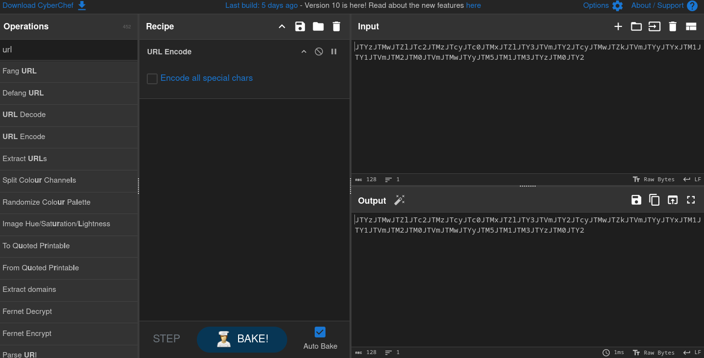
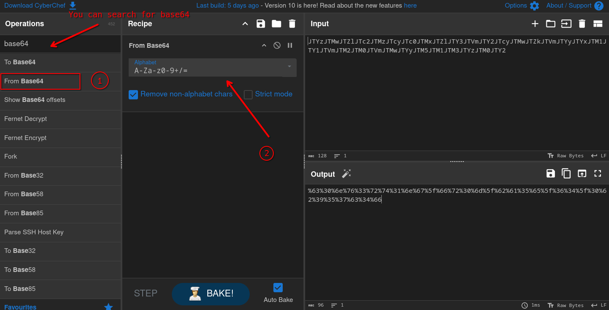
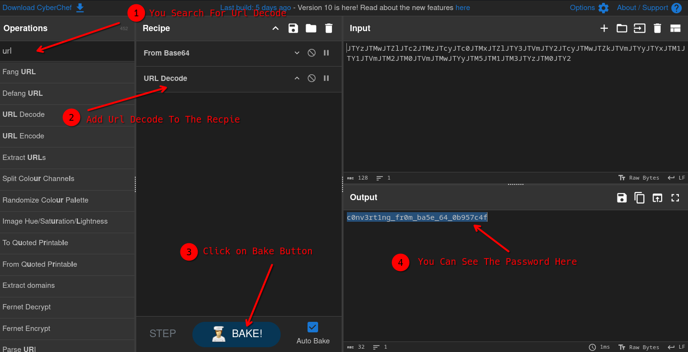

# Vault Door 5

## Introduction
In this post, I'll walk you through my experience solving a picoCTF challenge called "Vault Door 5". This challenge involves analyzing Java source code to uncover a hidden password. It's a great exercise for beginners interested in reverse engineering and source code analysis. I'll share the steps I took to crack the code and the thought process behind reversing the logic.

## My Experience
Day by Day passed and we seek for new Challenge to solve so here we have one:
<hr/>
In the last challenge, you mastered octal (base 8), decimal (base 10), and hexadecimal (base 16) numbers, but this vault door uses a different change of base as well as URL encoding! The source code for this vault is here: VaultDoor5.java
<hr/>
This is the fifth Vault Door challenge, another Java-based challenge. Let's take a look at the code we have here and investigate it: 

```Java
import java.net.URLDecoder;
import java.util.*;

class VaultDoor5 {
    public static void main(String args[]) {
        VaultDoor5 vaultDoor = new VaultDoor5();
        Scanner scanner = new Scanner(System.in);
        System.out.print("Enter vault password: ");
        String userInput = scanner.next();
        String input = userInput.substring("picoCTF{".length(), userInput.length() - 1);
        if (vaultDoor.checkPassword(input)) {
            System.out.println("Access granted.");
        } else {
            System.out.println("Access denied!");
        }
    }

    public String base64Encode(byte[] input) {
        return Base64.getEncoder().encodeToString(input);
    }

    public String urlEncode(byte[] input) {
        StringBuffer buf = new StringBuffer();
        for (int i = 0; i < input.length; i++) {
            buf.append(String.format("%%%2x", input[i]));
        }
        return buf.toString();
    }

    public boolean checkPassword(String password) {
        String urlEncoded = urlEncode(password.getBytes());
        String base64Encoded = base64Encode(urlEncoded.getBytes());
        String expected = "JTYzJTMwJTZlJTc2JTMzJTcyJTc0JTMxJTZlJTY3JTVm"
                        + "JTY2JTcyJTMwJTZkJTVmJTYyJTYxJTM1JTY1JTVmJTM2"
                        + "JTM0JTVmJTMwJTYyJTM5JTM1JTM3JTYzJTM0JTY2";
        return base64Encoded.equals(expected);
    }
}
```
Look what we have here: base64 encoding. Let's see what the important part of the code does:
```Java
    public String urlEncode(byte[] input) {
        StringBuffer buf = new StringBuffer();
        for (int i=0; i<input.length; i++) {
            buf.append(String.format("%%%2x", input[i]));
        }
        return buf.toString();
    }

    public boolean checkPassword(String password) {
        String urlEncoded = urlEncode(password.getBytes());
        String base64Encoded = base64Encode(urlEncoded.getBytes());
        String expected = "JTYzJTMwJTZlJTc2JTMzJTcyJTc0JTMxJTZlJTY3JTVm"
                        + "JTY2JTcyJTMwJTZkJTVmJTYyJTYxJTM1JTY1JTVmJTM2"
                        + "JTM0JTVmJTMwJTYyJTM5JTM1JTM3JTYzJTM0JTY2";
        return base64Encoded.equals(expected);
    }
```

It looks like they couldn't use the built-in URL encoding for this challenge, so they wrote their own custom URL encoding. It works similarly to standard URL encoding. You might wonder, what exactly does URL encoding do?

URL encoding converts characters into a format that can be safely transmitted over the Internet.

For example, imagine we have this URL:

`https://example.com/hello world`

This string can't be used as a URL because `hello world` contains an invalid space character `" "`. It needs to be converted into a valid URL. Here's the properly encoded version:

`https://example.com/hello%20world`

Now that we know what URL encoding is, let's continue. If you analyze the `checkPassword` function, it takes the password as an argument and converts it to URL encoding. Then, it takes the result of the URL encoding and applies another encoding: base64 encoding.  

Base64 encoding is another type of encoding used in this code, similar to hex (base 16), binary (base 2), or decimal (base 10). It represents data using a base64 system, which is commonly used to encode binary data as text.  

After converting the result of URL encoding to base64, the code checks if it is equal to:  

```
JTYzJTMwJTZlJTc2JTMzJTcyJTc0JTMxJTZlJTY3JTVmJTY2JTcyJTMwJTZkJTVmJTYyJTYxJTM1JTY1JTVmJTM2JTM0JTVmJTMwJTYyJTM5JTM1JTM3JTYzJTM0JTY2
```

Now that we understand how the password is encoded, we need to decode it by reversing the encoding process.  
First, we decode the base64 string, and then we use URL decoding to get the correct password.

For this example, instead of using Java code to decode it, I used an online tool called `CyberChef`.

### CyberChef
- You can open CyberChef in your favorite web browser and copy the encoded string into the input field:  
  

- After that, drag and drop the **From Base64** operation into the recipe area to decode the base64:  
  

- Next, add the **URL Decode** operation to the recipe. Finally, click the **Back** button at the bottom of the recipe area to see the decoded result:  
  


<br/>

The password is:
```
c0nv3rt1ng_fr0m_ba5e_64_0b957c4f
```

Therefore, the flag is:
```
picoCTF{c0nv3rt1ng_fr0m_ba5e_64_0b957c4f}
```
