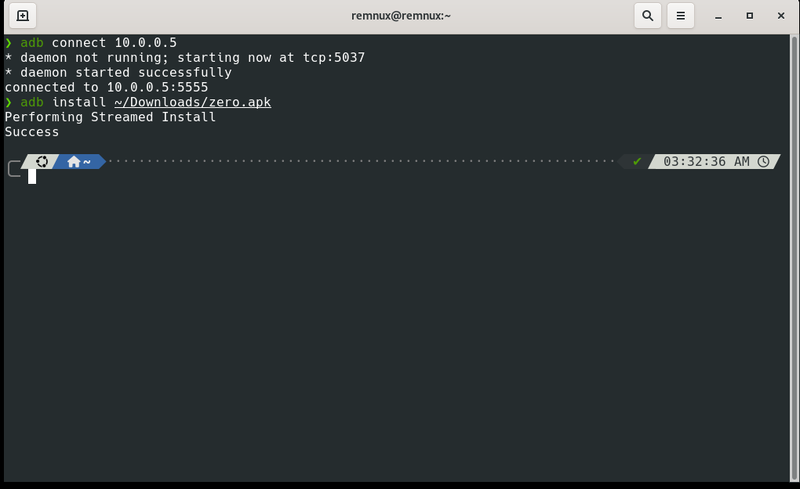
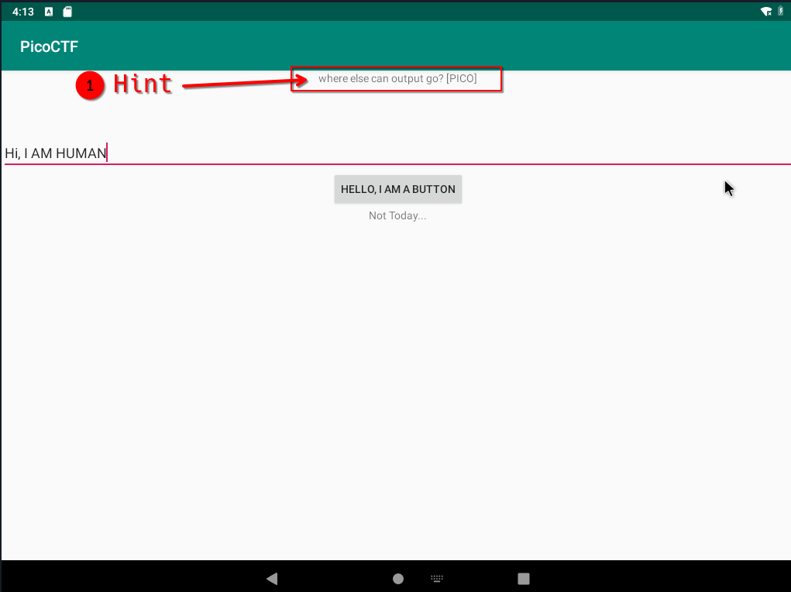
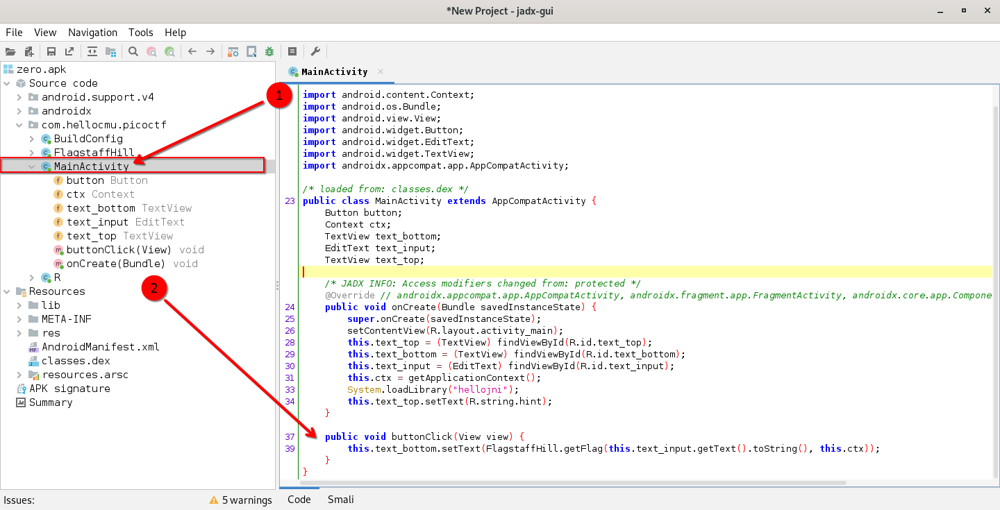
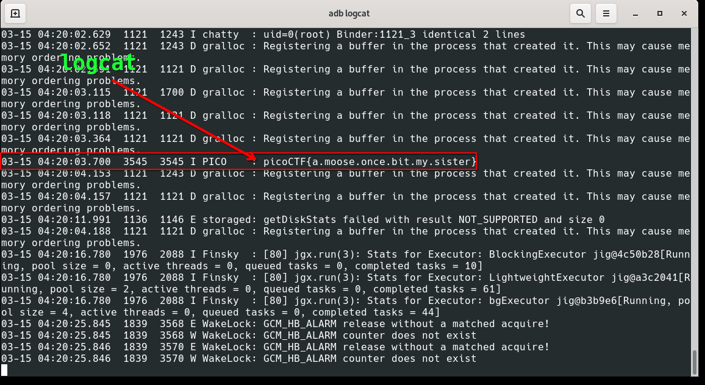

# 🚀 Droids 0

- **📛 Challenge Name:** Droids0  
- **🎯 Difficulty:** Hard  
- **🔗 Challenge:** [View on PicoCTF](https://play.picoctf.org/practice/challenge/11?category=3&originalEvent=1&page=2)  
- **🤖 File Type:** APK  

## Introduction  
In this write-up, we will walk through solving the `Droids0` challenge using `adb` and `jadx` to reverse-engineer the APK and extract the flag.  

## My Experience  

### Challenge Question:  
---
> Where do droid logs go. Check out this file. 
---

## Reverse Engineering Steps  

### 1️⃣ Installing the APK with ADB  
  

### 2️⃣ Opening the App in Android x86 VM  

#### App Menu  
  

#### App View  
  

### 3️⃣ Analyzing the APK with JADX  

#### MainActivity  
  

#### FlagstaffHill Class  
  

### 4️⃣ Extracting Logs with ADB Logcat  
  

## 🎉 The Flag  

```
picoCTF{a.moose.once.bit.my.sister}
```
