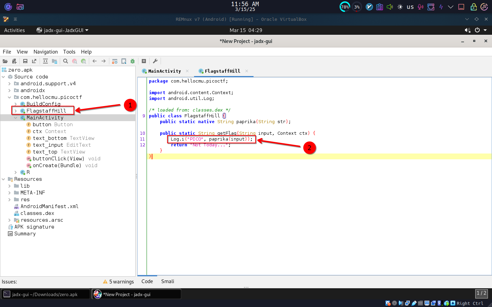

# 🚀 Droids 0

- **📛 Challenge Name:** Droids0  
- **🎯 Difficulty:** Hard  
- **🔗 Challenge:** [View on PicoCTF](https://play.picoctf.org/practice/challenge/11?category=3&originalEvent=1&page=2)  
- **🤖 File Type:** APK  

## Introduction  🚀🤖🔍 
In this write-up, we will walk through solving the `Droids0` challenge using `adb` and `jadx` to reverse-engineer the APK and extract the flag.  

## My Experience  🎯📱🛠️  
Today, I tried to solve another challenge. Let's see what question we have here.  

### Challenge Question:  🎭🔎📜  
---  
> Where do droid logs go? Check out this file.  
---  

## Reverse Engineering Steps  🛠️📂🔍 
I downloaded the file and saw my first APK to reverse-engineer. So, I googled what an APK is and how to analyze it.  

I learned how to work with `adb`, installed Android x86 in my VMs, picked up some `jadx` and `smali`, and then came back here to solve this challenge.  

By the way, I use Linux for solving this challenge with an Android x86 VM—you can use Windows too.  

I set up my Linux VM (REMnux) side by side with my Android x86 VM. One VM runs REMnux, and the other runs Android x86.  

### 1️⃣ Installing the APK with ADB 
Let's install the APK in the Android x86 VM using ADB.  

  

After installing, let's see what it has to show us.  🎬🔍👀  

### 2️⃣ Opening the App in Android x86 VM  
Let's open Android x86.
Oh, there's a new app named `picoCTF`, but it doesn't have an icon. Let's open it.  

#### App Menu   
  

The app takes input and has a hint that says, "where else output can go." There's also a button labeled "Hello, I AM A Button."  

Let's try filling in some input and see what happens. It shows a message: "not today."  

#### App View  📱👀🔍 
  

### 3️⃣ Analyzing the APK with JADX  
Let's switch to REMnux, open the app in `jadx`, and check what's going on.  

#### MainActivity  
I found `MainActivity`. If you don’t know, in Android, the `MainActivity` is like the main page of the app—Android calls them "activities."  

Inside `MainActivity`, there's a `buttonClick` function that runs when the button is clicked. This function calls another function from the `FlagstaffHill` class: `getFlag`. Let's open that class and check its function.  

  

#### FlagstaffHill Class  
The `FlagstaffHill` class contains the `getFlag` function we need to analyze. This function simply logs the flag as output and returns "not today."  

That means the flag is hidden in the logs! Let's check the output using `adb logcat`.  

  

### 4️⃣ Extracting Logs with ADB Logcat   
Let's run `logcat` with `adb` and then click the button in the Android x86 VM running the `picoCTF` app to capture the output.  

Oh! It prints the flag in the logs: `picoCTF{a.moose.once.bit.my.sister}`  🎉

  

## 🎉 The Flag  
```
picoCTF{a.moose.once.bit.my.sister}
```

