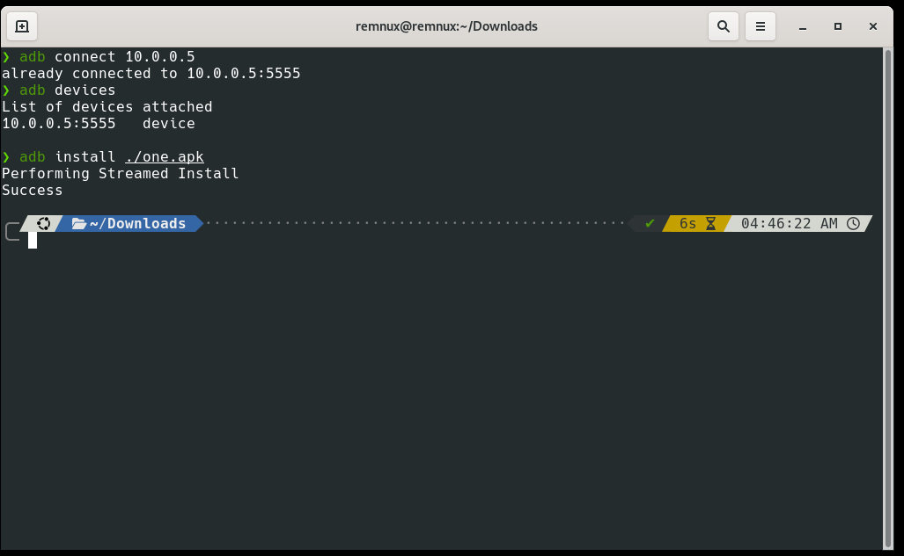
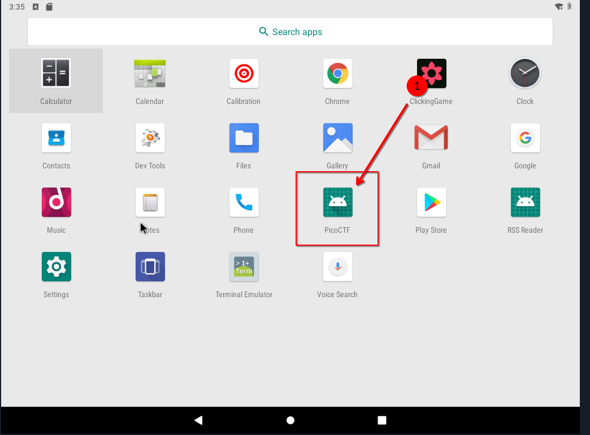
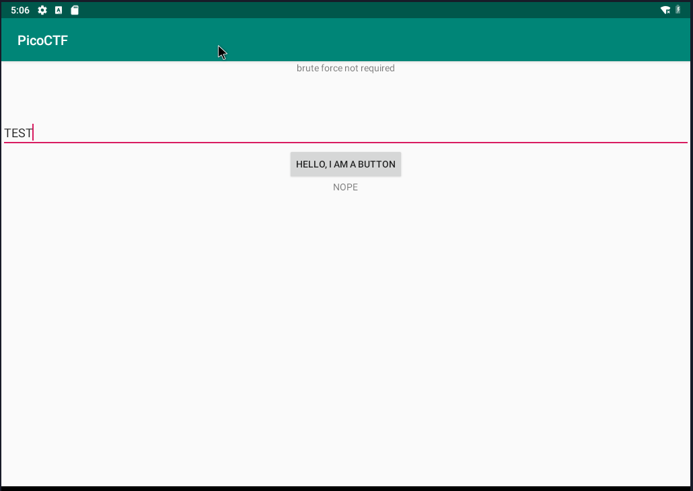
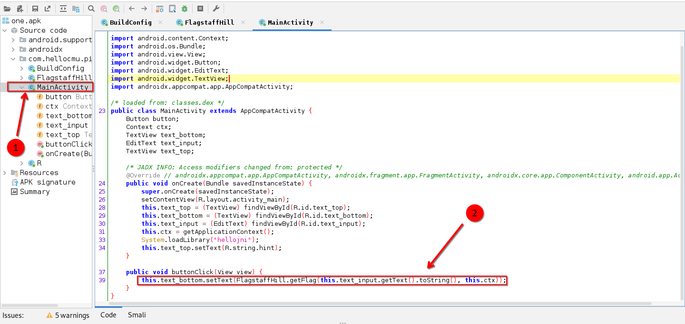
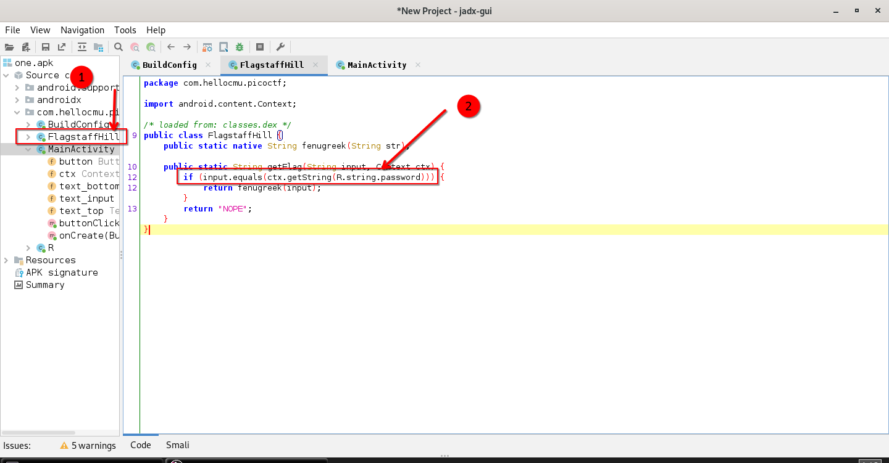
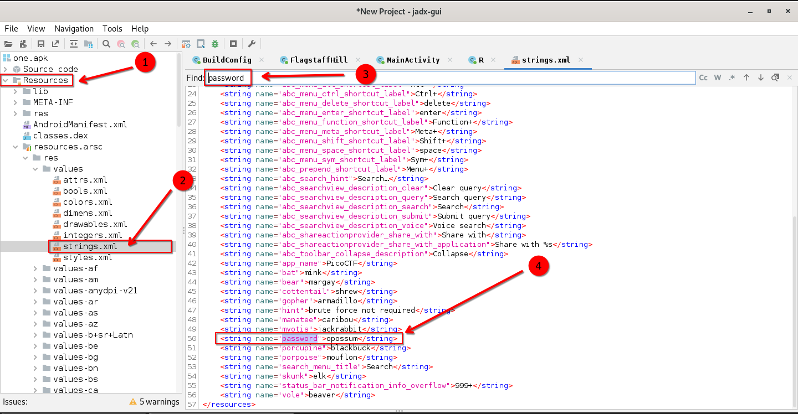
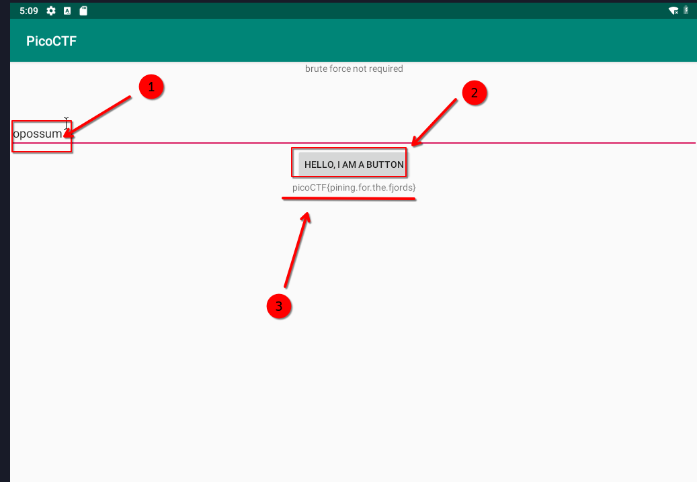

# 🚀 Droids 1  

- **📛 Challenge Name:** Droids1  
- **🎯 Difficulty:** Hard  
- **🔗 Challenge:** [View on PicoCTF](https://play.picoctf.org/practice/challenge/14?category=3&originalEvent=1&page=2)  
- **🤖 File Type:** APK  

## Introduction 🚀🤖🔍  
In this write-up, we will walk through solving the `Droids1` challenge using `adb` and `jadx` to reverse-engineer the APK and extract the flag.  

## My Experience 🎯📱🛠️  
Let's solve this challenge together.  
First, let's see what the challenge asks us to do.  

### Challenge Question 🎭🔎📜  
---  
> Find the pass, get the flag. Check out this file.  
---  

## Reverse Engineering Steps 🛠️📂🔍  
Let's download the file and inspect it.  
It's an APK file, so we need some tools. I used Linux for solving this challenge alongside an Android x86 VM—you can use Windows too.  

I set up my Linux VM (REMnux) next to my Android x86 VM. One runs REMnux, and the other runs Android x86.  

### 1️⃣ Installing the APK with ADB  
Let's install the APK in the Android x86 VM using ADB.  

  

After installing, let's see what the app does. 🎬🔍👀  

### 2️⃣ Opening the App in Android x86 VM  
Now, let's open Android x86.  

#### App Menu  
There's a new app named `picoCTF`, but it doesn't have an icon. Let's open it.  

  

When we enter some input, the app responds with `"NOPE"`.  

#### App View 📱👀🔍  
  

### 3️⃣ Analyzing the APK with JADX  
Let's switch to REMnux, open the app in `jadx`, and inspect the code.  

#### MainActivity  
I found `MainActivity`. In Android apps, `MainActivity` is the main entry point of the app—Android calls these "activities."  

Inside `MainActivity`, there's a `buttonClick` function that executes when the button is clicked. This function calls another function from the `FlagstaffHill` class: `getFlag`. Let's check that class.  

  

#### FlagstaffHill Class  
The `FlagstaffHill` class contains the `getFlag` function, which verifies the password. If the input matches the correct password stored in the resource strings, it returns the flag; otherwise, it returns `"NOPE"`.  

That means the password is stored in the app's resources! Let's check the resource files.  

  

#### Analyzing the Resource Strings and Locating the Password

Inside `resources.arac > res > values > strings.xml`, we find all string resources. Searching for the password there...  

Oh, here it is! The password is: `opossum`  

  

### 4️⃣ Entering the Password & Retrieving the Flag
Now, let's enter the password in the app running on Android x86 VM.  

It works! The message below the button displays the flag `picoCTF{pining.dor.the.fjords}  `

  

## 🎉 The Flag  
```
picoCTF{pining.dor.the.fjords}
```
