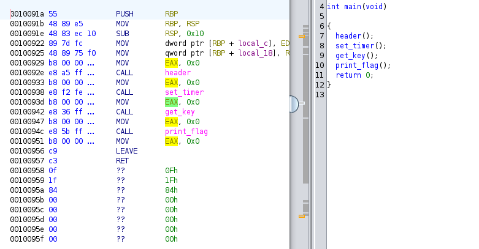
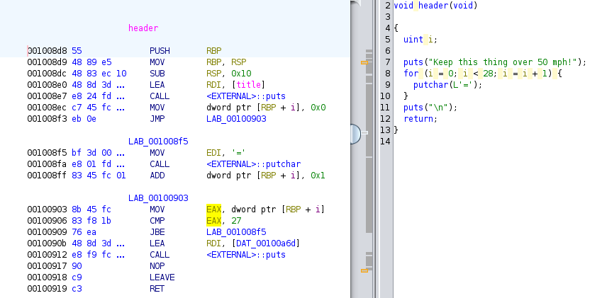
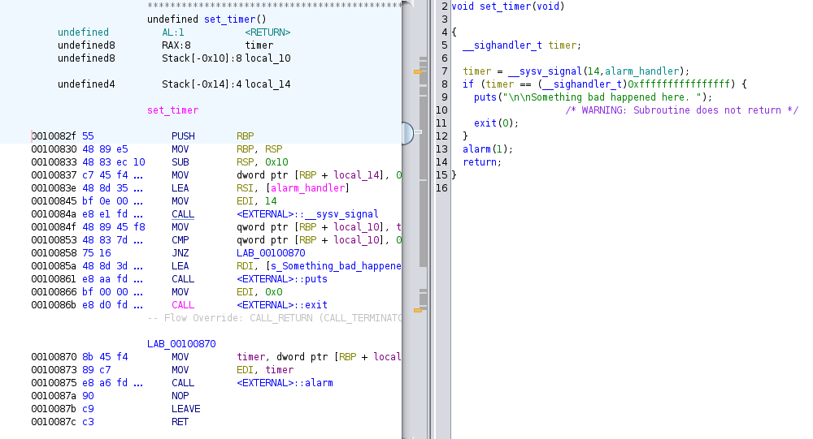
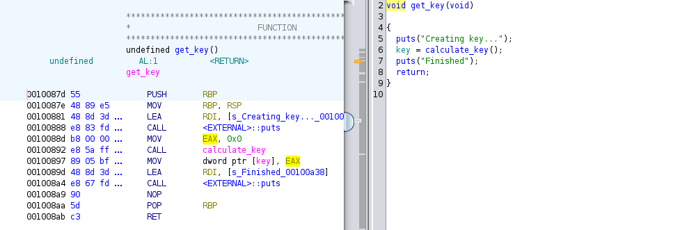
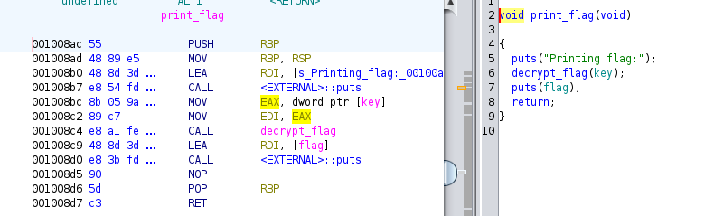

# Need for Speed

## Introduction
In this post, we will walk through solving the `Need for Speed` challenge and use Ghidra to assist us in reverse-engineering (SRE) the challenge to uncover the flag.

## My Experience
New challenge called `Need for Speed`. It reminds me of the game `Need for Speed`. Let's take a look at the question.

<hr/>
The name of the game is speed. Are you quick enough to solve this problem and keep it above 50 mph? need-for-speed.
<hr/>
Let's download it and use the `file` command in Linux to check what type of file this is. 

Let’s check the `file` command output below:


```console
remnux@remnux:/home/remnux/Downloads$ file need-for-speed
need-for-speed: ELF 64-bit LSB pie executable, x86-64, version 1 (SYSV), dynamically linked, interpreter /lib64/ld-linux-x86-64.so.2, for GNU/Linux 3.2.0, BuildID[sha1]=b4b1e824082c140091043151ab990149efa44806, not stripped
```
It's an ELF file, so if we want to run it, we need Linux. I’ll use REMnux. Let’s run it and see what’s going on.


```bash
sudo chmod +x ./need-for-speed && ./need-for-speed
Keep this thing over 50 mph!
============================

Creating key...
Not fast enough. BOOM!
```

We have some text that can be useful for SRE, like `Keep this thing over 50 mph!` or `Not fast enough. BOOM!`.

Let’s open the file in Ghidra and find the main function.



So, we have four functions called in the main function.

### `header` function
The first one is `header`. Let’s check it and see what it does.



As you can see, this function simply prints the message `Keep this thing over 50mph` to the output and then uses a for loop to print 27 `=` characters.

We see this when running the program:

```txt
Keep this thing over 50 mph!
============================
```

### `set_timer` function
Let’s check the next function called in the main function. The `set_timer` function is the next one we need to investigate. Let's find out what it does.



If you search online, like I did, you'll find that you can create a signal with `__sysv_signal` and assign a number to it to identify which signal was called. In this code, signal 14 is assigned, and later, an `alarm` is set for 1 second to run the `alarm_handler`. The `alarm_handler` function is responsible for preventing the creation of a key and printing a message.

```
Not fast enough. BOOM!
```
We found the problem, so one solution is to prevent the `set_timer` function from running, so it can't prevent the key from being created. This can be done by adding a `NOP` instruction where the function is called. Alternatively, a simpler way would be to replace the 1-second alarm with a bigger value, giving the key enough time to be created.

Before I continue, let me show the other functions in the main function.

### `get_key` function


### `print_flag` function



I used Cutter to replace `CALL set-timer` with the `NOP` instruction and ran the code, and I got this flag:

The flag is:
```
PICOCTF{Good job keeping bus #190ca38b speeding along!}
```
