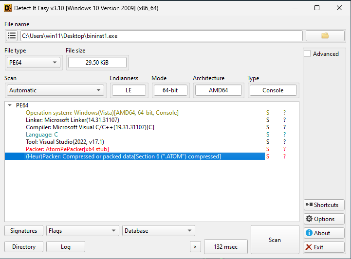
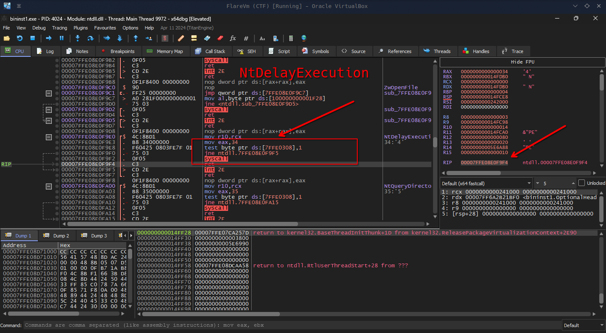
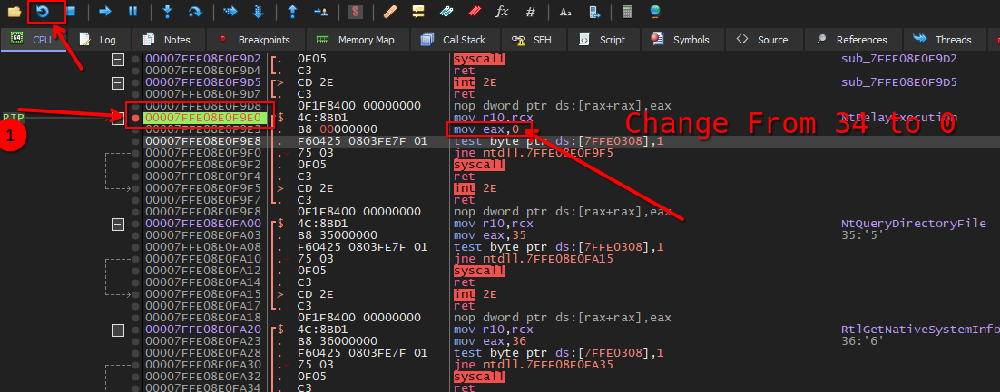
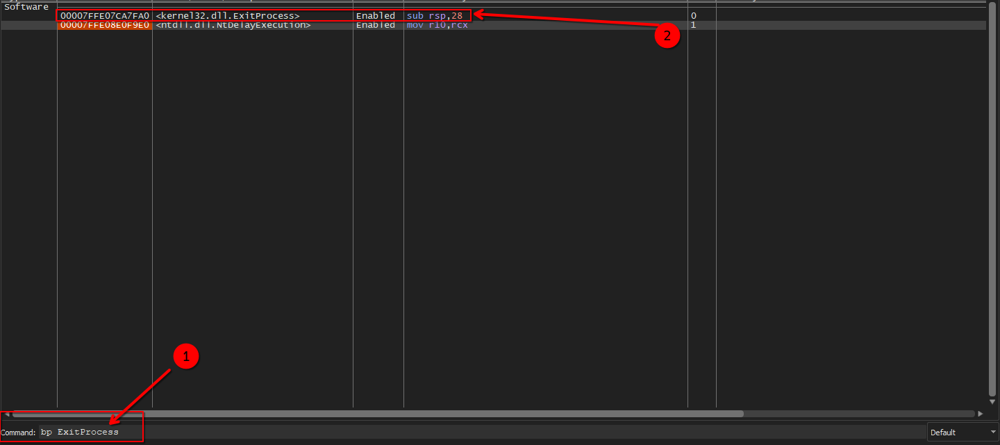
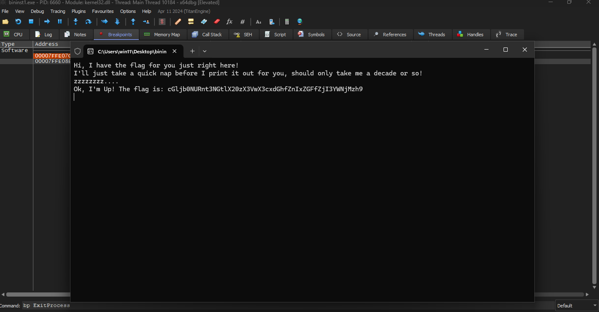

# 🚀 Binary Instrumentation 1

- **📛 Challenge Name:** Binary Instrumentation 1
- **🎯 Difficulty:** Medium  
- **🔗 Challenge:** [View on PicoCTF](https://play.picoctf.org/practice/challenge/451?category=3&originalEvent=74&page=1)
- **🪟 File Type:** Windows PE 

---

## Introduction
In this post, we walk through solving the `Binary Instrumentation 1` challenge, using tools like x64dbg and DIE to reverse-engineer the Portable Executable (PE) binary and prevent system calls from executing in order to uncover the flag.

## My Experience
"Let's take a look at the question and determine which file we need to reverse engineer.

### Challenge Question: 🎭🔎📜  
---  
> I have been learning to use the Windows API to do cool stuff! Can you wake up my program to get the flag? Download the exe here. Unzip the archive with the password picoctf 
---  
Alright, let's download the file, unzip it, and check its contents. The zip password is `picoctf`.

Ok, let's use DIE to analyze the file. Oh, we’ve encountered a packed file that uses the Atomic PE Packer, which is also written in C.

**NOTE: First of all, I'm really bad at unpacking files manually, and I searched on the internet to find something useful for unpacking packed files, but I couldn't find anything that helped. I tried hard to unpack it by adding a breakpoint on the `.Atom` section of the PE, but the code never reaches there. Maybe it reads data from that section, but unlike UPX, which runs from the UPX0 section, it doesn't do that. So, I couldn't unpack the file and decided to continue reverse engineering it.**



Let’s run the file and see what it gives us:

```console
Hi, I have the flag for you just right here!
I'll just take a quick nap before I print it out for you, should only take me a decade or so!
zzzzzzzz....
```

Okay, the program is stuck at `zzzzzz....`. It seems there is some Windows API, as the question mentions, that runs and prevents us from continuing to run the program.

So, let's use dynamic analysis and try to find that API to see where the program is stuck in the x64dbg debugger.

I ran x64dbg with the debugger and executed the program to see where it stops. It stops at a specific breakpoint, syscall 34, which is `NtDelayExecution` (by the way, x64dbg displays the syscall that is being called, and I also googled that too).



So, what if we prevent this syscall from running? We could set its value to a dummy value, for example, zero, to prevent `NtDelayExecution` from executing. I checked that syscall zero means `STATUS_SUCCESS`, so why not set it to zero? Let's add a breakpoint before the syscall, restart the program, and change the value to zero.



Before we continue, if we run the program, it closes the terminal. So, let's add a breakpoint on `ExitProcess` to prevent the program from closing the terminal. Also, there's no need to have the breakpoint enabled on the `NtDelayExecution` syscall, so let's disable that as well.



Let’s continue debugging and see what it gives us. Oh, it gives us this message:

```
Ok, I'm Up! The flag is: cGljb0NURnt3NGtlX20zX3VwX3cxdGhfZnIxZGFfZjI3YWNjMzh9
```



But it’s not the flag yet, because when I tried it, it didn’t work. So, I searched and analyzed it. Thanks to GPT, I figured out that it’s Base64 encoded. Let’s convert that using this command on Windows:

```powershell
[System.Text.Encoding]::UTF8.GetString([System.Convert]::FromBase64String("cGljb0NURnt3NGtlX20zX3VwX3cxdGhfZnIxZGFfZjI3YWNjMzh9"))
```

This gives us the flag:

```
picoCTF{w4ke_m3_up_w1th_fr1da_f27acc38}
```

## 🎉 The Flag  
```
picoCTF{w4ke_m3_up_w1th_fr1da_f27acc38}
```