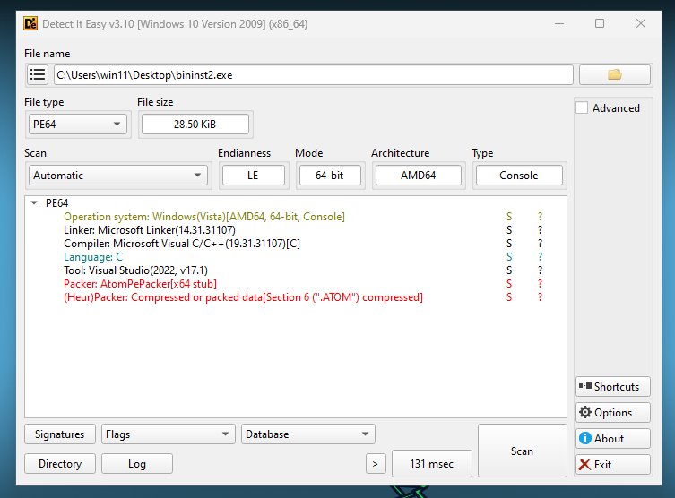

# 🚀 Binary Instrumentation 2

- **📛 Challenge Name:** Binary Instrumentation 2
- **🎯 Difficulty:** Medium  
- **🔗 Challenge:** [View on PicoCTF](https://play.picoctf.org/practice/challenge/452?category=3&originalEvent=74&page=1)
- **🪟 File Type:** Windows PE 


### Introduction
In this post, we walk through solving the `Binary Instrumentation 2` challenge using tools like x64dbg and DIE to reverse-engineer the Portable Executable (PE) binary and intercept system calls to uncover the flag.

### My Experience
Let's take a look at the challenge and determine which file we need to reverse engineer.

### Challenge Question: 🎭🔎📜  
---  
> I've been learning more Windows API functions to do my bidding. Hmm... I swear this program was supposed to create a file and write the flag directly to the file. Can you try and intercept the file writing function to see what went wrong? Download the exe here. Unzip the archive with the password `picoctf`.  
---  

Like the previous challenge, let's download and unzip the file. Since the challenge mentions a password, we use `picoctf` to extract it, expecting a PE executable file.

Next, let's analyze the file using DIE. Oh, we’ve encountered a packed file that uses the Atomic PE Packer, which is also written in C.

**NOTE:** I’m really bad at manually unpacking files. I searched online for tools that could help but found nothing useful. I tried to unpack it by setting a breakpoint on the `.Atom` section of the PE, but the code never reaches there. Maybe it reads data from that section, but unlike UPX, which executes from the UPX0 section, this one doesn’t. So, I couldn't unpack it and decided to continue reverse engineering.



### Running the File
Let's run the file and see what happens.

Okay, it does nothing and crashes with exit code `-1`. I confirmed this using WinDbg, but you don’t need to test it yourself.

### Debugging with x64dbg
Let's open the binary in x64dbg.

#### Setting a Breakpoint on `CreateFile`
Since the challenge suggests the program fails to create and write a file, the best approach is to locate the functions responsible for these actions. Since the program is packed, it's hard to find these functions directly. Instead, we can go to the **Symbols** tab in x64dbg and set a breakpoint on `CreateFileA` and `CreateFileW` in `kernel32.dll`.


#### Setting a Breakpoint on `WriteFile`
We should also set a breakpoint on `WriteFile` in `kernel32.dll` to capture when the program attempts to write to the file.


### Hitting the Breakpoint at `CreateFile`
Let's run the program and see if it hits our breakpoints.

Oh, it hit the `CreateFile` breakpoint! Now, let's check what file path it's trying to create.

In Windows x64, function arguments are passed in registers in the following order:

| Argument  | Register | Notes |
|------------|----------|-------------------------|
| 1st        | `RCX`   | First argument (integer/pointer) |
| 2nd        | `RDX`   | Second argument |
| 3rd        | `R8`    | Third argument |
| 4th        | `R9`    | Fourth argument |
| 5th+       | Stack   | Remaining arguments are pushed on stack |

Looking at `RCX`, we see it holds the file path: `<Insert Path here>`.


### Modifying the File Path in Memory
Now, let's modify the memory to change the file path.

Right-click on `RCX` and follow it in the dump to see where `<Insert Path here>` is stored.


Select the memory region storing the file path, right-click, and choose **Edit Data**. Replace it with a valid path, ensuring the new value isn’t longer than the original. I used `C:\flag.txt`.


### Hitting the Breakpoint at `WriteFile`
Now, let the program continue execution. If you check the path we set, you'll see the file is created, though you might not be able to open it since it’s still in use by the program.

When execution stops at the `WriteFile` breakpoint, let's examine the arguments:

```c
BOOL WriteFile(
    HANDLE       hFile,         // RCX
    LPCVOID      lpBuffer,      // RDX
    DWORD        nNumberOfBytesToWrite, // R8
    LPDWORD      lpNumberOfBytesWritten, // R9
    LPOVERLAPPED lpOverlapped   // Stack [rsp+40]
);
```

From the function signature, `RDX` contains the buffer being written to the file. Let's inspect it.

Oh, it holds a Base64-encoded value!


### Extracting the Flag Data
To extract the flag, follow the dump at the `RDX` address.

Right-click and choose **Follow Dump**.


Select the part of memory storing the Base64 string, right-click, and choose **Edit Data** to copy it.

The extracted value:
```
cGljb0NURntmcjFkYV9mMHJfYjFuX2luNXRydW0zbnQ0dGlvbiFfYjIxYWVmMzl9
```


### Decoding the Base64 String
Now, let's decode it using PowerShell.

```powershell
[System.Text.Encoding]::UTF8.GetString([System.Convert]::FromBase64String("cGljb0NURntmcjFkYV9mMHJfYjFuX2luNXRydW0zbnQ0dGlvbiFfYjIxYWVmMzl9"))
```

This gives us the flag:
```
picoCTF{fr1da_f0r_b1n_in5trum3nt4tion!_b21aef39}
```

### 🎉 The Flag  
```
picoCTF{fr1da_f0r_b1n_in5trum3nt4tion!_b21aef39}
```

